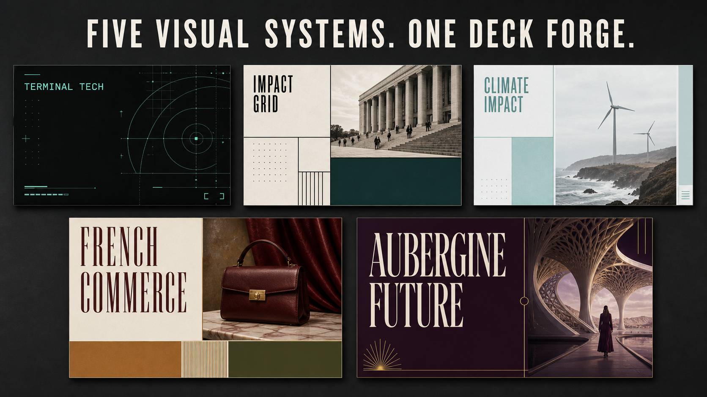
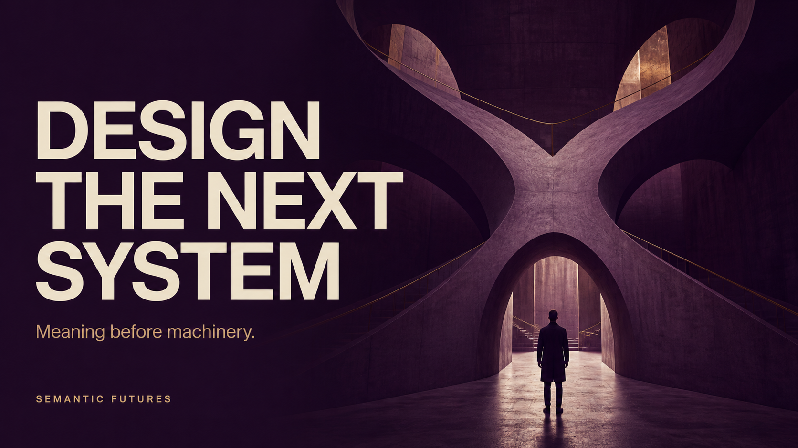

# Image 2 Deck Forge

> Turn raw documents into cinematic, image-first presentations with a locked visual language.



[](skills/image2-deck-forge/SKILL.md)
[](skills/image2-deck-forge/styles/catalog.md)
[](#how-it-works)
[](LICENSE)

Image 2 Deck Forge is a reusable Codex skill for building decks that look art-directed instead of assembled. It extracts the argument, selects one visual system, writes a slide-by-slide image plan, renders every slide as a finished 16:9 composition with Image 2, and packages the approved images into an image-only PPTX.

No theme roulette. No slide-to-slide identity drift. No decorative AI wallpaper pretending to be visual reasoning.

## Five visual systems, five distinct voices

| Visual system | What it feels like | Best for |
|---|---|---|
| Terminal Tech Magazine | A precision terminal became a design journal | AI, devtools, systems, security |
| Impact Grid Editorial | An institutional report learned visual authority | Strategy, research, consulting |
| Climate Impact Editorial Grid | Field evidence meets Swiss editorial discipline | Climate, ESG, sustainability |
| French Editorial Commerce | A Parisian magazine art-directs the product story | Fashion, retail, beauty, lifestyle |
| Aubergine Semantic Future | Future thinking without the generic robot apocalypse | AI futures, transformation, concepts |

### Terminal Tech Magazine


Sparse terminal geometry, signal mint, credible technical imagery, and exactly zero cyberpunk clutter.

### Impact Grid Editorial


Warm paper, hard editorial modules, documentary evidence, and an argument you can understand from the back row.

### Climate Impact Editorial Grid


Cool paper, muted field photography, sea-glass accents, and an evidence-first environmental voice.

### French Editorial Commerce


Cream paper, condensed display type, serif contrast, tactile imagery, and taste without the luxury cliche machine.

### Aubergine Semantic Future



The signature new system: deep plum, ivory and pale gold, monumental type, and imagery chosen from the meaning of the claim. Robots are rationed.

## What makes it different

- **One Style Lock per deck.** Typography, palette, grid, containers, image direction, density, and negative rules stay coherent.
- **Meaning before imagery.** Every visual must advance the slide thesis.
- **Approval gates that matter.** Outline and prompt plan first, thumbnail board next, full deck last.
- **Image-only output.** The final PPTX is a faithful stack of approved 16:9 slide images.
- **Built to extend.** Add a style by writing one compact contract and running the validator.
- **Revision without identity drift.** Fix one slide, preserve the deck's visual DNA.

## How it works

```text
source document
    -> narrative extraction
    -> style selection
    -> slide architecture
    -> Image 2 prompt plan
    -> thumbnail board
    -> approved 16:9 slide renders
    -> image-only PPTX + source images
```

The skill deliberately uses Image 2 for visual slide rendering. It does not reconstruct slides with HTML, SVG, canvas, or programmatic drawing.

## Install

Clone the repository, then copy the skill directory into your Codex skills folder.

```bash
git clone https://github.com/lp7743951-star/image2-deck-forge.git
cp -R image2-deck-forge/skills/image2-deck-forge ~/.codex/skills/
```

Then invoke it naturally:

```text
Use $image2-deck-forge to turn this strategy document into a 12-slide deck.
Use the Aubergine Semantic Future style and show me the thumbnail board first.
```

## Add your own visual system

1. Copy an existing file in [`styles/`](skills/image2-deck-forge/styles/).
2. Define its identity, use cases, visual DNA, Style Lock, page behavior, prompt prefix, and quality gate.
3. Add it to [the catalog](skills/image2-deck-forge/styles/catalog.md).
4. Run:

```bash
python skills/image2-deck-forge/scripts/validate_style_library.py
```

See [Style Authoring](skills/image2-deck-forge/references/style-authoring.md) for the contract.

## Repository map

```text
skills/image2-deck-forge/
|-- SKILL.md
|-- agents/openai.yaml
|-- styles/                 # five reusable visual systems
|-- references/             # workflow, page types, output and revision contracts
`-- scripts/validate_style_library.py

assets/
|-- style-atlas.png
`-- previews/               # one instant visual proof per style
```

## Design promise

A deck should not look like twelve unrelated prompts that accidentally share a filename. Image 2 Deck Forge treats a presentation as a single visual world with narrative progression, recurring composition logic, and controlled variation.

The reference images in this repository were generated specifically to demonstrate the included visual systems. They are not third-party templates or brand assets.

## License

MIT. Fork it, extend it, build your own style library, and make the next deck impossible to ignore.

